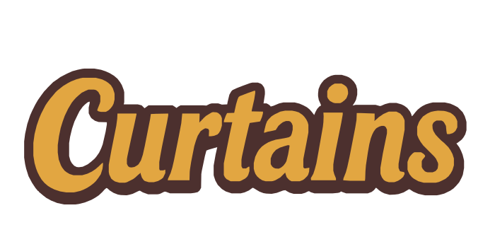
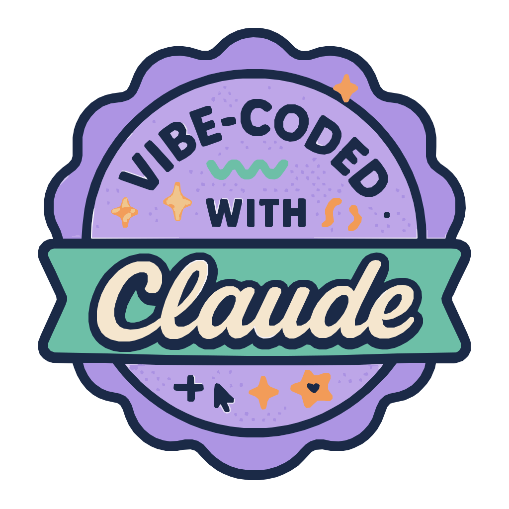
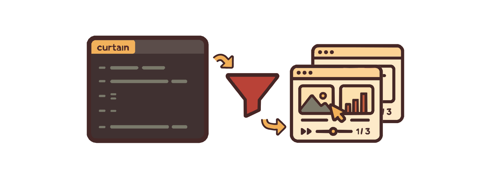

<p align="center">
  
  
  
</p>

Curtains is a powerful presentation builder that converts extended Markdown files (`.curtain`) into self-contained HTML presentations with support for custom styling, containers, and runtime navigation.

## Overview

Curtains transforms simple Markdown-based presentation files into beautiful, interactive HTML presentations. It extends standard Markdown with layout containers and CSS styling capabilities, making it easy to create professional presentations without complex tools.


<p align="center">
  
</p>

### Key Features

- **Extended Markdown Support**: Full CommonMark support with additional presentation features
- **Custom Containers**: Layout control with `<container>` elements for complex slide structures
- **Image Support**: Native support for `` tags with class attributes and security filtering
- **CSS Styling**: Global and slide-specific CSS styling support
- **Self-Contained Output**: Generates single HTML files with embedded styles and runtime
- **Keyboard Navigation**: Arrow keys, spacebar, and fullscreen support (F key)
- **Touch Support**: Click/tap to advance slides
- **Theme Support**: Built-in light and dark themes with CSS variables
- **Type-Safe**: Written in TypeScript with comprehensive Zod validation
- **Tested**: Extensive test coverage for all components

## Installation

### Local Installation

```bash
npm install curtains
```

### Global Installation

```bash
npm install -g curtains
```

### Development Setup

```bash
git clone https://github.com/yourusername/curtains.git
cd curtains
npm install
npm run build
```

## Usage

### Basic Command

```bash
curtains build presentation.curtain -o slides.html
```

### With Theme Selection

```bash
curtains build presentation.curtain -o slides.html --theme dark
```

### Command Options

- `build` - Build a .curtain file into an HTML presentation
- `-o, --output` - Output HTML file (default: input.html)
- `--theme` - Theme selection: light or dark (default: light)
- `-h, --help` - Show help
- `-v, --version` - Show version

## File Format

Curtains uses `.curtain` files with the following structure:

```curtain
<style>
/* Global styles for all slides */
.centered { text-align: center; }
</style>

===

# First Slide

Content in **Markdown** format.

<style>
/* Styles specific to this slide */
h1 { color: blue; }
</style>

===

## Second Slide

More content here.
```

### Key Concepts

1. **Slide Delimiter**: Use `===` on its own line to separate slides
2. **Global Styles**: CSS before the first `===` applies to all slides
3. **Slide Styles**: CSS within a slide applies only to that slide
4. **Containers**: Use `<container class="classname">` for layout control
5. **Images**: Use `` tags or Markdown image syntax
6. **Markdown**: Full CommonMark support within slides

## Examples

### Simple Presentation

```curtain
<style>
/* Global styles */
body { font-family: sans-serif; }
</style>

===

# Welcome
Introduction to Curtains

===

## Features
- Easy to use
- Powerful styling
- Self-contained output

===

## Thank You!
```

### Advanced Layout with Containers

```curtain
<style>
.columns {
  display: grid;
  grid-template-columns: 1fr 1fr;
  gap: 2rem;
}
.hero {
  min-height: 100vh;
  display: flex;
  align-items: center;
  justify-content: center;
  background: linear-gradient(45deg, #667eea, #764ba2);
  color: white;
}
</style>

===

<container class="hero">
# My Presentation
</container>

===

<container class="columns">
  <container class="left">
  ### Key Points
  - First point
  - Second point
  </container>

  <container class="right">
  
  </container>
</container>
```

### Using Images

```curtain
===

## Slide with Images

You can use standard Markdown image syntax:


Or HTML img tags with classes:


===
```

## Architecture

Curtains follows a four-phase pipeline architecture:

```
.curtain file → Parser → Transformer → Renderer → .html file
```

### Components

#### 1. Parser (`src/parser/`)
- Splits content on `===` delimiters
- Extracts and validates CSS styles
- Parses container elements with class validation
- Processes `` tags with security filtering (strips dangerous attributes)
- Converts Markdown to AST using remark
- Validates all input with Zod schemas

#### 2. Transformer (`src/transformer/`)
- Converts AST to HTML using rehype
- Transforms containers to `<div>` elements
- Wraps root slide content in staging container for proper layout
- Adds `target="_blank"` to external links
- Scopes slide CSS with nth-child selectors

#### 3. Renderer (`src/renderer/`)
- Merges CSS layers (base → theme → global → slide)
- Builds complete HTML structure
- Embeds JavaScript runtime for navigation
- Generates self-contained output file

#### 4. Runtime (Browser)
- Keyboard navigation (arrows, space, F for fullscreen)
- Click/touch navigation
- Slide counter display
- Smooth transitions between slides

## API Documentation

### Main Functions

#### `parse(input: string): CurtainsDocument`
Parses a .curtain file into a structured document AST.

#### `transform(document: CurtainsDocument): TransformedDocument`
Transforms the AST into HTML and scoped CSS.

#### `render(transformed: TransformedDocument, options: BuildOptions): Promise<string>`
Renders the final HTML presentation.

### Data Structures

#### CurtainsDocument
```typescript
{
  type: 'curtains-document'
  version: '0.1'
  slides: CurtainsSlide[]
  globalCSS: string
}
```

#### CurtainsSlide
```typescript
{
  type: 'curtains-slide'
  index: number
  ast: CurtainsAST
  slideCSS: string
}
```

#### BuildOptions
```typescript
{
  input: string    // .curtain file path
  output: string   // .html file path
  theme: 'light' | 'dark'
}
```

## Navigation Controls

### Keyboard
- **Right Arrow / Space**: Next slide
- **Left Arrow**: Previous slide
- **F**: Toggle fullscreen

### Mouse/Touch
- **Click/Tap**: Next slide

## Theming

Curtains includes comprehensive CSS variable support for theming:

### CSS Variables (Partial List)
- `--curtains-bg-primary`: Primary background color
- `--curtains-text-primary`: Primary text color
- `--curtains-accent-primary`: Accent color
- `--curtains-link-default`: Link color
- `--curtains-code-bg`: Code block background

Full theme variables are defined in `src/templates/style.css`.

## Development

### Scripts

```bash
npm run build         # Build TypeScript to JavaScript
npm run test          # Run test suite
npm run test:watch    # Run tests in watch mode
npm run test:coverage # Generate coverage report
npm run lint          # Run ESLint
npm run format        # Format with Prettier
npm run dev           # Build in watch mode
```

### Project Structure

```
curtains/
├── bin/              # CLI entry point
├── src/
│   ├── ast/          # AST type definitions and schemas
│   ├── cli.ts        # CLI implementation
│   ├── config/       # Configuration schemas and constants
│   ├── parser/       # Parse .curtain files to AST
│   ├── renderer/     # Generate final HTML output
│   ├── templates/    # CSS and HTML templates
│   └── transformer/  # Transform AST to HTML
├── docs/             # Documentation
└── dist/             # Compiled JavaScript output
```

### Testing

The project uses Jest for testing with comprehensive test coverage:

```bash
npm test                    # Run all tests
npm run test:watch          # Watch mode
npm run test:coverage       # Coverage report
npm run test:cli            # Test CLI functionality
```

## Error Handling

Curtains provides detailed error messages with specific exit codes:

| Exit Code | Meaning |
|-----------|---------|
| 0 | Success |
| 1 | Invalid arguments |
| 2 | File access error |
| 3 | Parse error |
| 4 | No slides found |
| 5 | Output write error |

## Limitations

- Maximum 99 slides per presentation
- Maximum 10 levels of container nesting
- Container class names must match `/^[a-zA-Z0-9_-]+$/`
- Output is a single HTML file (no external dependencies)

## Contributing

Contributions are welcome! Please ensure:

1. All tests pass (`npm test`)
2. Code is formatted (`npm run format`)
3. Linting passes (`npm run lint`)
4. Type checking passes (`npm run type-check`)

## License

ISC

## Author

chancegraff

## Version

1.0.0
